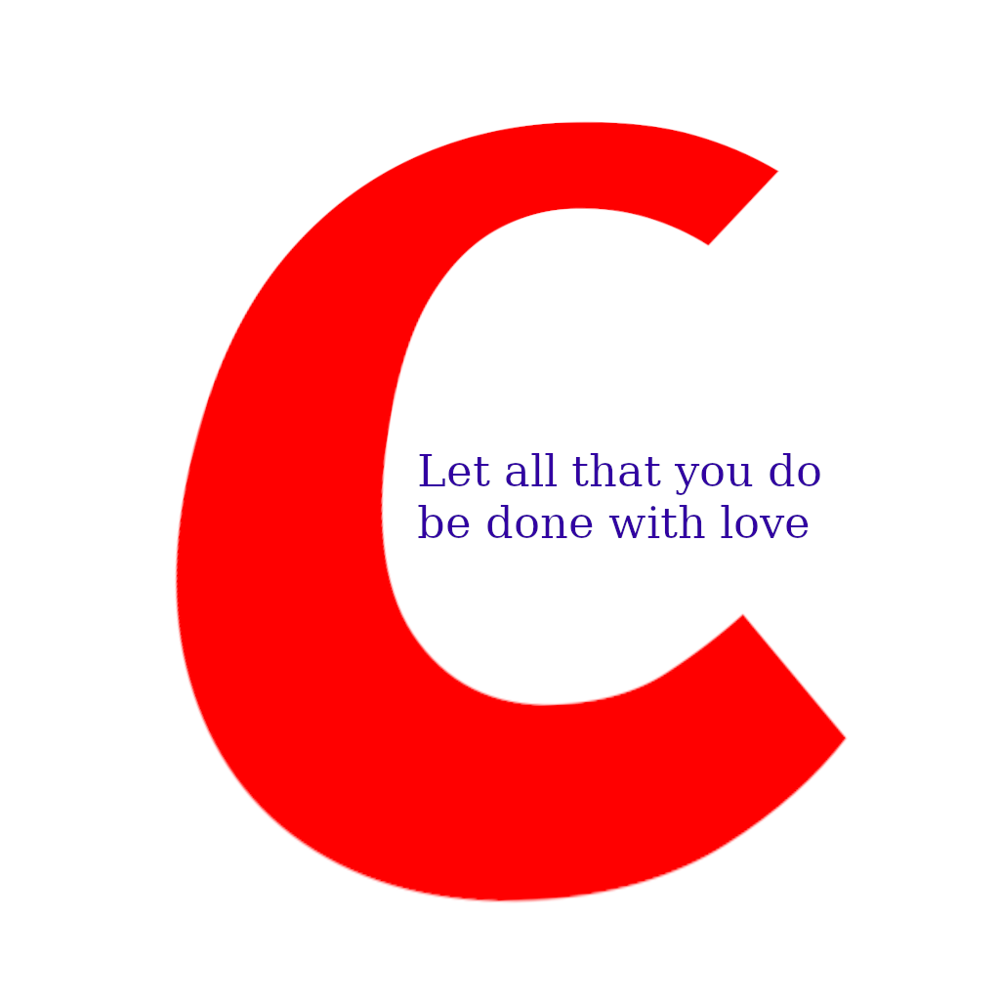

# C Chads Main Code Repository

### Programs are organized by the dominating license in their respective repositories.
### LICENSE files in directories cover the licenses for those files.
Building:
All makefile-maintainer approved programs are automatically built by doing
"make -B" in the top level of the repository.

Programs and libraries with unusual build dependencies will not build by default.

Programs that do not build by default are listed when you invoke make -B

At a minimum to build this library you will need:
* the gnu compiler collection, suggested version 8 or later.
* rm and cd commands in your shell
* gnu make (to use the build system)

These programs were written (or used) by the C Chads.

### I WANT TO JOIN

Make an issue on our  
